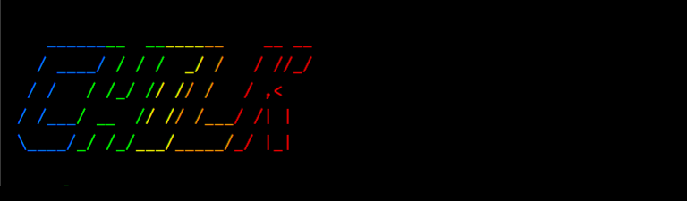
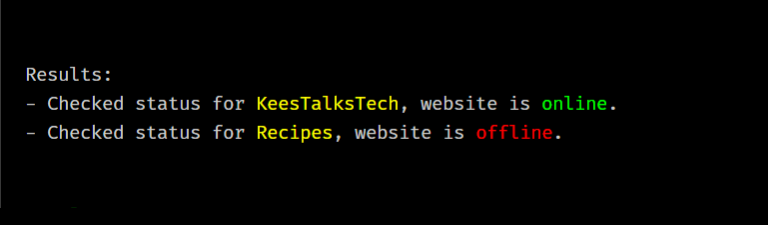
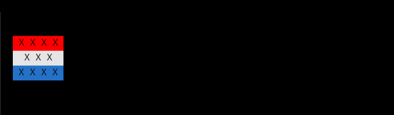

# Chilk -- for the 💖 of ASCII art

I. Love. ASCII. Art. Seriously I can't make a NodeJS CLI or Chatbot without adding a decent splash-screen to it. That's why I love <a href="https://www.npmjs.com/package/chalk">Chalk</a>. But creating those strings got a little too verbose, that's why I created this simple lib.


```js
const { asciiArtChilker } = require("chilk");

console.log(asciiArtChilker.colorize(`

b   ______g__  __y____o__    r__ __
b  / ____/g / / /y  _/o /   r/ //_/
b / /   g/ /_/ /y/ /o/ /   r/ ,<   
b/ /___g/ __  /y/ /o/ /___r/ /| |  
b\\____/g_/ /_/y___/o_____/r_/ |_|  

`));
```

It produces:



Note: I use the <a href="https://patorjk.com/software/taag/#p=display&f=Graffiti&t=CHILK">TAAG by patorjk</a> to generate the art.


## Text highlight
If you want to highlight text, we use the default `chilker` like this:

```js
const { chilker } = require("chilk");

console.log("Results:");
console.log(chilker.colorize("- Checked status for [y]KeesTalksTech[/], website is [g]online[/]."));
console.log(chilker.colorize("- Checked status for [y]Recipes[/], website is [r]offline[/]."));
```

It produces:



## Own mappings
Can I make my own tokens? Yes, you can!

```js
const { Chilker } = require("chilk");
const chalk = require("chalk");

const x = new Chilker();
x.set("[r]", chalk.bgRed.black);
x.set("[w]", chalk.bgWhite.black);
x.set("[b]", chalk.bgBlue.black);
x.set("[/]", chalk.reset);

console.log(x.colorize(`
[r] X X X X 
[w]  X X X  
[b] X X X X 
[/]         `));
});

```

It produces:



## Extend
Can I extend the mappings? Yes you can!

```js
const { asciiArtChilker } = require("chilk");
const chalk = require("chalk");

// global extend:
asciiArtChilker.set("p", chalk.hex("#FFC0CB")); // add HTML pink

// or clone to use extend locally:
const x = asciiArtChilker.clone();
x.set("p", chalk.hex("#FFC0CB")); // add HTML pink


```